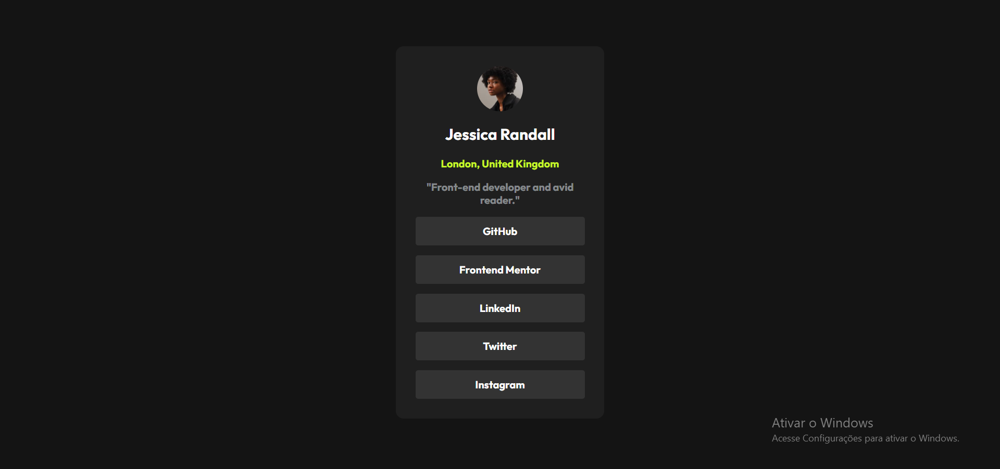

# Perfil-de-links-sociais
# Frontend Mentor - Social links profile solution

Esta é uma solução para o desafio [Social links profile no Frontend Mentor](https://www.frontendmentor.io/challenges/social-links-profile-UG123oLhp). Os desafios do Frontend Mentor ajudam você a melhorar suas habilidades em HTML e CSS construindo projetos reais.

## 📋 Sumário

- [Visão Geral](#visão-geral)
  - [O desafio](#o-desafio)
  - [Screenshot](#screenshot)
  - [Links](#links)
- [Meu processo](#meu-processo)
  - [Tecnologias utilizadas](#tecnologias-utilizadas)
  - [O que eu aprendi](#o-que-eu-aprendi)
- [Autor](#autor)

---

## 🚀 Visão Geral

### O desafio

Os usuários devem ser capazes de:
- Ver os estados de hover/foco em todos os elementos interativos da página.
- Visualizar o layout ideal para o site, dependendo do tamanho da tela do dispositivo.

### Screenshot

### Links

- URL do repositório: https://github.com/yuri010409/Perfil-de-links-sociais
- URL do site no ar: https://yuri010409.github.io/Perfil-de-links-sociais/

---

## 🛠️ Meu processo

### Tecnologias utilizadas

- **HTML5** semântico (`<main>`, `<ul>`, `<li>`)
- **CSS3** customizado
- **Flexbox** para layout e centralização
- Design responsivo para dispositivos móveis

### O que eu aprendi

Neste projeto, pratiquei conceitos fundamentais de front-end, como:
- Centralização de elementos com **Flexbox** no CSS.
- Organização semântica de links de navegação usando listas (`<ul>` e `<li>`).
- Ajustes de `padding` e dimensionamento de caixas com `box-sizing: border-box`.

---

## 👤 Autor

- GitHub - @yuri010409
